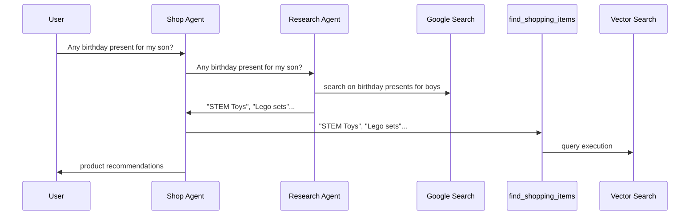
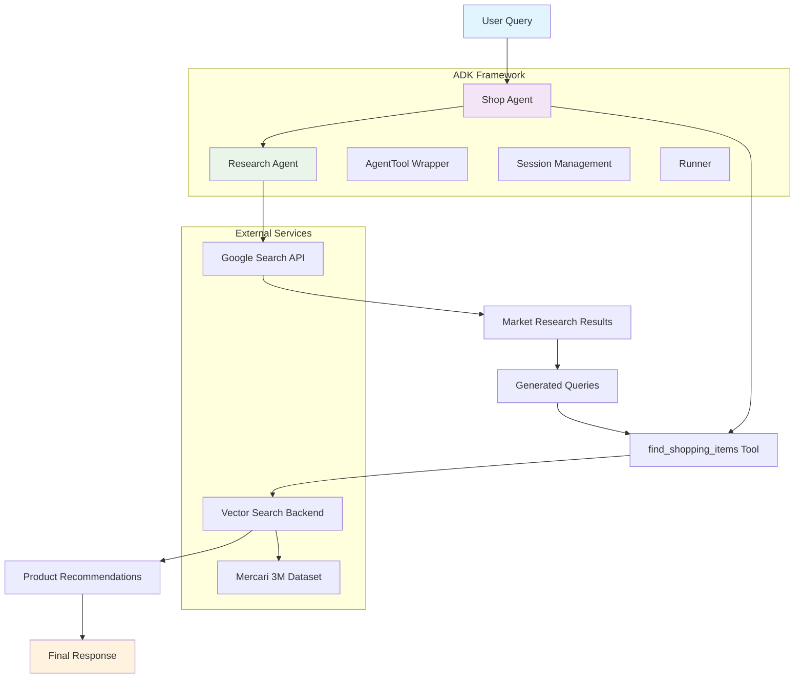
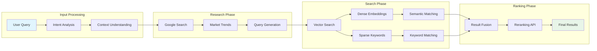

# ADK Project 01: E-commerce Recommendation AI Agents

A sophisticated **multi-agent e-commerce recommendation system** built with Google's Agent Development Kit (ADK) and Vector Search technology. This project demonstrates "Generative Recommendation" - an AI system that intelligently understands, expands, and generates search queries based on deeper user intent analysis.

## 🚀 Project Overview

This system goes beyond simple keyword matching to provide intelligent product recommendations by:

- **Understanding User Intent**: Interprets underlying needs from vague queries
- **Leveraging External Research**: Uses Google Search for real-time market research  
- **Generating New Queries**: Creates multiple specific, diverse search queries
- **Expanding Search Scope**: Discovers relevant products users might not have explicitly searched for

### Example Flow
```
User Input: "Any birthday present for my son?"
↓
System Research: Searches Google for "birthday presents for boys"
↓
Generated Queries: "STEM Toys", "Lego sets", "educational toys for 10-year-olds"
↓
Final Results: Curated product recommendations from vector search
```

## 🏗️ System Architecture

### High-Level Architecture Diagram



### Component Architecture



### Data Flow Architecture



### Agent Interaction Model

```mermaid
graph TB
    subgraph "Shop Agent (Orchestrator)"
        SA[Shop Agent<br/>gemini-2.5-flash]
        SA_TOOLS[Tools:<br/>• AgentTool(research_agent)<br/>• find_shopping_items]
    end
    
    subgraph "Research Agent (Specialist)"
        RA[Research Agent<br/>gemini-2.5-flash]
        RA_TOOLS[Tools:<br/>• google_search]
    end
    
    subgraph "External Integrations"
        GS[Google Search API]
        VS[Vector Search Backend]
        MM[Mercari 3M Dataset]
    end
    
    SA --> SA_TOOLS
    SA_TOOLS --> RA
    RA --> RA_TOOLS
    RA_TOOLS --> GS
    SA_TOOLS --> VS
    VS --> MM
    
    style SA fill:#f3e5f5
    style RA fill:#e8f5e8
    style GS fill:#fff3e0
    style VS fill:#fff3e0
```

## 🔧 Technical Components

### 1. Research Agent
- **Role**: Market researcher for e-commerce site
- **Model**: `gemini-2.5-flash`
- **Tools**: Google Search
- **Function**: Analyzes user intent and generates 5 targeted search queries

### 2. Shop Agent
- **Role**: Shopper's concierge
- **Model**: `gemini-2.5-flash`
- **Tools**: Research Agent (via AgentTool), find_shopping_items
- **Function**: Orchestrates the entire recommendation workflow

### 3. Vector Search Integration
- **Dataset**: Mercari 3M multimodal index (`mercari3m_mm`)
- **Features**: 
  - Multimodal search (dense + sparse)
  - Hybrid approach with reranking
  - Handles both text and image data

## 🛠️ Key Features

### Agent-as-Tool Pattern
```python
shop_agent = Agent(
    model='gemini-2.5-flash',
    name='shop_agent',
    tools=[
        AgentTool(agent=research_agent),  # Agent delegation
        find_shopping_items,              # Custom function tool
    ],
)
```

### Multi-Modal Search
```python
payload = {
    "query": query,
    "dataset_id": "mercari3m_mm",
    "use_dense": True,     # Semantic similarity
    "use_sparse": True,    # Keyword matching
    "rrf_alpha": 0.5,      # Balanced weighting
    "use_rerank": True,    # Result optimization
}
```

### Intelligent Query Generation
- Transforms vague queries into specific searches
- Uses market research to inform recommendations
- Balances user intent with current trends

## 📋 Prerequisites

- Python 3.8+
- Google API Key (Gemini)
- Access to Vector Search backend
- Required packages: `google-adk`, `google-generativeai`

## 💡 Usage Examples

### Basic Product Search
```python
query = "birthday present for 10 year old boy"
result = await test_agent(query, shop_agent)
```

### Gift Recommendations
```python
query = "anniversary gift for wife who loves cooking"
result = await test_agent(query, shop_agent)
```

## 🔄 Advanced Patterns Demonstrated

### 1. **Multi-Agent Orchestration**
- Research agent specializes in market research
- Shop agent orchestrates the overall workflow
- Clean separation of concerns

### 2. **External API Integration**
- Google Search for real-time research
- Vector Search for product discovery
- Custom tool wrappers for seamless integration

### 3. **Intent Expansion**
- Vague queries → specific searches
- Market trend integration
- Context-aware recommendations

## 🌟 Real-World Applications

This pattern extends to:

- **Product Discovery**: Find products users didn't know existed
- **Gift Recommendations**: Intelligent suggestions based on recipient analysis
- **Market Research**: Automated competitive analysis
- **Content Curation**: Expand searches based on preferences
- **Travel Planning**: Comprehensive options from simple requests

## ⚡ Performance Considerations

### Optimizations
- Batch query processing for efficiency
- Async agent execution
- Potential for result caching

### Scalability
- Session management (consider persistent storage for production)
- API rate limiting considerations
- Load balancing for high traffic

### Error Handling
- Graceful degradation on API failures
- Input validation and sanitization
- Fallback search strategies

## 📚 Technical Stack

- **Framework**: Google Agent Development Kit (ADK)
- **Models**: Gemini 2.5 Flash
- **Search**: Google Search API, Vector Search
- **Dataset**: Mercari 3M multimodal index
- **Language**: Python 3.8+

## 🤝 Contributing

1. Fork the repository
2. Create a feature branch
3. Make your changes
4. Add tests if applicable
5. Submit a pull request

## 📄 License

This project is licensed under the MIT License - see the LICENSE file for details.

## 🔗 Related Resources

- [Google ADK Documentation](https://google.github.io/adk-docs/)
- [Gemini API Documentation](https://ai.google.dev/gemini-api/docs)
- [Vector Search Documentation](https://cloud.google.com/vertex-ai/docs/vector-search)

## 📞 Support

For questions and support:
- Check the [ADK Documentation](https://google.github.io/adk-docs/)
- Open an issue in this repository
- Join the ADK community discussions

---

**Built with ❤️ using Google Agent Development Kit**